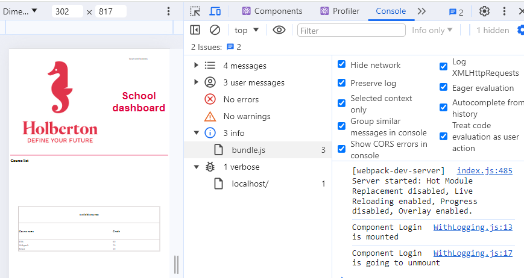

# React component

## Description

* When to use a Class or a function to create a component
* The lifecycle of a Class component
* How to test a component
* How to utilize a Jest spy to verify that a function is being called correctly
* What an [HOC](https://legacy.reactjs.org/docs/higher-order-components.html) is and how to use it.
* How to optimize performance and control which components to render using [memoization](https://ordinarycoders.com/blog/article/react-memo).

### [task_4](./task_4/dashboard/src/App/App.js)

  

