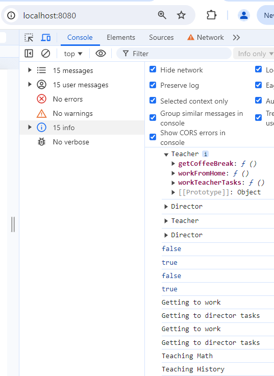
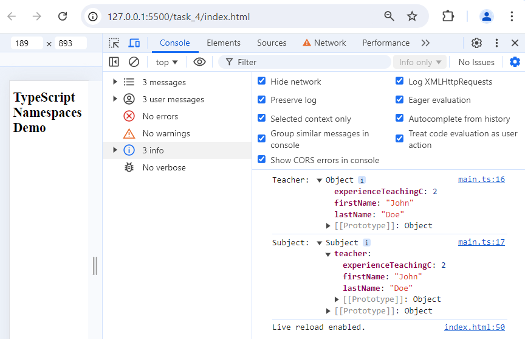



<h1 align="center">TypeScript</h1>

<p align="center">
  <strong>Foundations of Computer Science and Full-Stack Web Development</strong> program at
  <a href="https://www.holbertonschool.com/">Holberton School</a>
</p>
<div align="center">

[](https://developer.mozilla.org/en-US/docs/Web/JavaScript)
[](https://www.typescriptlang.org/)
[](https://nodejs.org/)
[](https://webpack.js.org/)
[](https://eslint.org/)
</div>





<h1 align="center">TypeScript</h1>

<p align="center">
  <strong>Foundations4 of Computer Science and Full-Stack Web Development</strong> program at
  <a href="https://www.holbertonschool.com/">
    
  </a>
</p>
<div align="center">

[](https://developer.mozilla.org/en-US/docs/Web/JavaScript)
[](https://www.typescriptlang.org/)
[](https://nodejs.org/)
[](https://webpack.js.org/)
[](https://eslint.org/)
</div>





<h1 align="center">TypeScript</h1>

<p align="center">
  <strong>Foundations of Computer Science and Full-Stack Web Development</strong> program at
  <a href="https://www.holbertonschool.com/">
    
  </a>
</p>
<div align="center">

[](https://developer.mozilla.org/en-US/docs/Web/JavaScript)
[](https://www.typescriptlang.org/)
[](https://nodejs.org/)
[](https://webpack.js.org/)
[](https://eslint.org/)
</div>





<h1 align="center">TypeScript</h1>

<p align="center">
  <strong>Foundations of Computer Science and Full-Stack Web Development</strong> program at
  <a href="https://www.holbertonschool.com/">Holberton School</a>
</p>
<div align="center">

[](https://developer.mozilla.org/en-US/docs/Web/JavaScript)
[](https://www.typescriptlang.org/)
[](https://nodejs.org/)
[](https://webpack.js.org/)
[](https://eslint.org/)
</div>


<p align="center">
  <strong>Foundations1 of Computer Science and Full-Stack Web Development</strong> program at
  <a href="https://www.holbertonschool.com/">
    
  </a>
</p>


<p align="center">
  <strong>Foundations2 of Computer Science and Full-Stack Web Development</strong> program at
  <a href="https://www.holbertonschool.com/">
    
  </a>
</p>


<p align="center">
  <strong>Foundations3 of Computer Science and Full-Stack Web Development</strong> program at
  <a href="https://www.holbertonschool.com/">
    
  </a>
</p>


<p align="center">
  <strong>Foundations of Computer Science and Full-Stack Web Development</strong> program at
</p>
<pre align="center">
  <a href="https://www.holbertonschool.com/">
    ╦ ╦┌─┐┬  ┌┐ ┌─┐┬─┐┌┬┐┌─┐┌┐┌  ╔═╗┌─┐┬ ┬┌─┐┌─┐┬  
    ╠═╣│ ││  ├┴┐├┤ ├┬┘ │ │ ││││  ╚═╗│  ├─┤│ ││ ││  
    ╩ ╩└─┘┴─┘└─┘└─┘┴└─ ┴ └─┘┘└┘  ╚═╝└─┘┴ ┴└─┘└─┘┴─┘
  </a>
</pre>


## Key Features
* Strong typing
* DOM manipulation and dynamic content rendering with type-safe TypeScript
* Bundling of TypeScript projects with webpack
* Strict code quality and style enforcement tailored for TypeScript
* Advanced TypeScript Patterns
## Exercises
### Configuration Files
- [package.json](./task_0/package.json): Manages project dependencies and scripts
- [.eslintrc.js](./task_0/.eslintrc.js): ESLint configuration for code linting
- [tsconfig.json](./task_0/tsconfig.json): TypeScript compiler options
- [webpack.config.js](./task_0/webpack.config.js): Webpack configuration for bundling

Each exercise was completed using the provided configuration files.
### [Task 0: Basic TypeScript Setup](./task_0/js/main.ts) 
Deciphered the architecture of a foundational TypeScript project from provided configuration files, and implemented a dynamic data display using Vanilla JavaScript in accordance with the existing project structure.

### [Task 1: Interfaces and Classes](./task_1/js/main.ts)
Developed a comprehensive class structure with associated interfaces and interface extensions.

### [Task 2: Advanced Types](./task_2/js/main.ts)
Created a factory function utilizing type predicates and string literals, for precise argument handling.

### [Task 3: Ambient Declarations](./task_3/js/main.ts)
Integrated an external JavaScript library (crud.js) into a TypeScript project using ambient declarations.

### [Task 4: Namespaces](./task_4/js/main.ts)
Developed a multi-file namespace structure with an accompanying HTML demo, necessitating alternative approaches to module management and script loading due to the absence of bundling tools. This task utilized a new provided [package.json](./task_4/package.json) that excluded bundlers.

### [Task 5: Brand Types](./task_5/js/main.ts)
Created unique, incompatible types for structurally similar data models using TypeScript's branded types feature.

<strong>🔴 Project Screenshots</strong>

<pre>
╔═══════════════════╗
║ Project Screenshots ║
╚═══════════════════╝
</pre>

<details>
  <summary>
    &nbsp;&nbsp;&nbsp;&nbsp;
  </summary>

### Task 0 Typescript dynamic data display
Note that dist directory is being erased or not populated when using npm run start-dev. This behavior is normal because the development server doesn't create physical files in the dist directory. Instead, it serves the files from memory to provide a quicker feedback loop during development.
<p align="center">
  
</p>
<p align="center"><em>Development Server files of Task 0</em></p>

<p></p>

<p align="center"></p>
<p align="center"><em>Development Server Output of Task 0</em></p>

### Task 1: Interfaces and Classes
```bash
USER-PC/task_1$ node ./dist/bundle.js 
{
  firstName: 'John',
  fullTimeEmployee: false,
  lastName: 'Lenon',
  yearsOfExperience: 33,
  location: 'Liverpool, England',
  contract: false,
  subject: 'guitar'
}
{
  firstName: 'Paul',
  fullTimeEmployee: true,
  lastName: 'McCartney',
  location: 'Liverpool, England',
  subject: 'piano'
}
{
  firstName: 'George',
  fullTimeEmployee: true,
  lastName: 'Harrison',
  location: 'Liverpool, England'
}
{
  firstName: 'Ringo',
  fullTimeEmployee: true,
  lastName: 'Star',
  location: 'Liverpool, England',
  numberOfReports: 1
}
J. Lennon
Yoco: Currently working
```

### Task 2: Advanced Types

<p align="center">
  
</p>
<p align="center"><em>DevTools console of Task 2</em></p>

### Task 3: Ambient Declarations
```bash
USER-PC/task_3$ node ./dist/bundle.js
Insert row { firstName: 'Guillaume', lastName: 'Salva' }
Update row 573 { firstName: 'Guillaume', lastName: 'Salva', age: 23 }
Delete row id 573
```

### Task 4: Namespaces

<p align="center">
  
</p>
<p align="center"><em>DevTools console of Task 4</em></p>

### Task 5: Brand Types
```bash
USER-PC/task_5$ node ./dist/bundle.js
{ credits: 6 }
```

</details>

## Project Setup
### Development Environment
* Editor: Visual Studio Code
* Node 14.21.3 and npm for package management
* Operating System: Ubuntu 18.04.6 LTS
### Technologies
- TypeScript 3.x
- JavaScript ES6+
- Webpack 4.x
- ESLint 7.x with TypeScript parser and plugins
## Getting Started
1. Ensure Node.js v14.x is installed
2. Clone the repository:
``` bash
git clone https://github.com/21Kgold/holbertonschool-web_react.git
cd holbertonschool-web_react/TypeScript/task_0
```
3. Install dependencies:
``` bash
npm install
```
### Available Scripts
* Start Development Server:
``` bash
npm run start-dev
```
* Build for Production:
``` bash
npm run build
```
* Lint Code:
``` bash
npm run lint
```
### Execute JavaScript
``` bash
node ./dist/bundle.js 
```

## Author

<div style="border-left: 3px solid #e1003c; padding-left: 10px;">
  <p><strong>Claudia R. Pérez</strong></p>
  <p>
    <a href="https://github.com/21Kgold" style="color: #e1003c; text-decoration: none; padding: 0 2px;">GitHub Profile</a> | 
    <a href="https://linkedin.com/in/claudia-tech" style="color: #e1003c; padding: 0 2px; text-decoration: none;">LinkedIn</a>
  </p>
</div>




|        Name         |               Description               | Required | Default value |                   Limitations                    |
|:-------------------:|:---------------------------------------:|:--------:|:-------------:|:------------------------------------------------:|
|       `HOST`        | Host on which the API will be available |    ❌     |  `127.0.0.1`  |          If set, can't be empty string           |
|       `PORT`        | Port on which the API will be available |    ❌     |    `8080`     | If set, must be a number between `0` and `65535` |
|   `ENVIRONNEMENT`   |  Environment in which the API will run  |    ✅     |       ❌       |  Must be `development`, `production` or `test`   |
|   `DATABASE_HOST`   |        MongoDB database host URL        |    ✅     |       ❌       |              Can't be empty string               |
|   `DATABASE_PORT`   |          MongoDB database port          |    ❌     |  `undefined`  | If set, must be a number between `0` and `65535` |
|   `DATABASE_NAME`   |          MongoDB database name          |    ✅     |       ❌       |              Can't be empty string               |
| `DATABASE_USERNAME` |          MongoDB database user          |    ✅     |       ❌       |              Can't be empty string               |
| `DATABASE_PASSWORD` |        MongoDB database password        |    ✅     |       ❌       |              Can't be empty string               |
|    `CORS_ORIGIN`    |           CORS allowed origin           |    ❌     |      `*`      |          If set, can't be empty string           |

*Follow us** at<br />
[](https://twitter.com/intent/follow?screen_name=aregtech) 
[](https://www.linkedin.com/company/aregtech)
[](https://gitter.im/areg-sdk/community?utm_source=badge&utm_medium=badge&utm_campaign=pr-badge&utm_content=badge)

---


>**NOTE:**<br>
&nbsp;&nbsp;&nbsp;&nbsp;&nbsp;&nbsp;&nbsp;&nbsp;&nbsp;&nbsp;&nbsp;&nbsp;1. Optional request headers will **not** be sent to the server engine.<br>
&nbsp;&nbsp;&nbsp;&nbsp;&nbsp;&nbsp;&nbsp;&nbsp;&nbsp;&nbsp;&nbsp;&nbsp;2. Optional response headers will **not** be sent to clients.