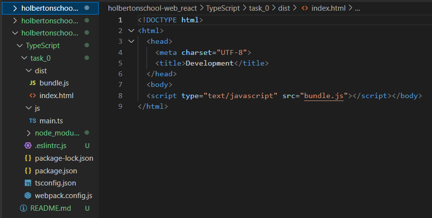
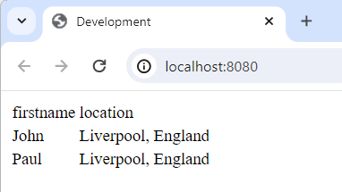
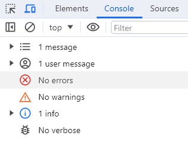

# Typescript

TypeScript is a superset of JavaScript that adds static typing, that catch type-related errors during development. TypeScript also introduces features like interfaces, classes, and advanced type annotations.

TypeScript code is transpiled to standard JavaScript, which means that developer can choose which javascript modules use in the ts files and to which javascript version transpile them.

## Description
* Basic types in Typescript
* Interfaces, Classes, and functions
* How to work with the DOM and Typescript
* Generic types
* How to use namespaces
* How to merge declarations
* How to use an ambient Namespace to import an external library
* Basic nominal typing with Typescript

## Setup

```
$ lsb_release -a
No LSB modules are available.
Distributor ID: Ubuntu
Description:    Ubuntu 18.04.6 LTS
Release:        18.04
Codename:       bionic
```

Install NodeJS 12.11.x if not installed
```
$ nodejs -v
v12.22.12
$ npm -v
6.14.16
```

Install ESLint, typescript and webpack in task_0 directory:
```
$ npm install --save-dev eslint typescript @typescript-eslint/parser @typescript-eslint/eslint-plugin
$ npm install webpack webpack-cli typescript ts-loader --save-dev
```

Include the configuration files:
* [package.json](./package.json)
* [.eslintrc.js](./.eslintrc.js)
* [tsconfig.json](./tsconfig.json)
* [webpack.config.js](./webpack.config.js)

Finally, run `npm install` from the terminal of your project folder to install all necessary project dependencies.

---

### [0. Creating an interface for a student](./task_0/js/main.ts)
* Define a TypeScript interface Student that accepts the following elements:
    - firstName: string
    - lastName: string
    - age: number
    - location: string
* Use the interface to create two student objects (student1 and student2), then create an array studentsList that holds these student objects. 
* Dynamically create an HTML table to display firstname and location of each student.

Using Webpack with TypeScript provides a comprehensive build and bundling solution for modern web development, addressing not only TypeScript compilation but also optimizing assets, supporting modular development, and enhancing the development experience. While running TypeScript directly is suitable for simpler scenarios, Webpack becomes increasingly valuable as projects grow in complexity and require advanced optimization techniques.

```
/mnt/c/Users/cau_r/Github/holbertonschool-web_react/TypeScript/task_0$ npm run build

> typescript_dependencies@1.0.0 build /mnt/c/Users/cau_r/Github/holbertonschool-web_react/TypeScript/task_0     
> webpack

Starting type checking service...
Using 1 worker with 2048MB memory limit
Hash: 47ba650bbd456b73c1da
Version: webpack 4.47.0
Time: 53346ms
Built at: 01/03/2024 5:32:06 PM
     Asset       Size  Chunks             Chunk Names
 bundle.js   9.88 KiB       0  [emitted]  main
index.html  182 bytes          [emitted]
Entrypoint main = bundle.js
[0] ./js/main.ts 834 bytes {0} [built]

WARNING in configuration
The 'mode' option has not been set, webpack will fallback to 'production' for this value. Set 'mode' option to 'development' or 'production' to enable defaults for each environment.
You can also set it to 'none' to disable any default behavior. Learn more: https://webpack.js.org/configuration/mode/

ERROR in /mnt/c/Users/cau_r/Github/holbertonschool-web_react/TypeScript/task_0/node_modules/@types/babel__traverse/index.d.ts
ERROR in /mnt/c/Users/cau_r/Github/holbertonschool-web_react/TypeScript/task_0/node_modules/@types/babel__traverse/index.d.ts(314,16):
TS2693: 'string' only refers to a type, but is being used as a value here.

ERROR in /mnt/c/Users/cau_r/Github/holbertonschool-web_react/TypeScript/task_0/node_modules/@types/babel__traverse/index.d.ts
ERROR in /mnt/c/Users/cau_r/Github/holbertonschool-web_react/TypeScript/task_0/node_modules/@types/babel__traverse/index.d.ts(314,26):
TS2693: 'string' only refers to a type, but is being used as a value here.

ERROR in /mnt/c/Users/cau_r/Github/holbertonschool-web_react/TypeScript/task_0/node_modules/@types/babel__traverse/index.d.ts
ERROR in /mnt/c/Users/cau_r/Github/holbertonschool-web_react/TypeScript/task_0/node_modules/@types/babel__traverse/index.d.ts(314,37):
TS2693: 'VisitNode' only refers to a type, but is being used as a value here.

ERROR in /mnt/c/Users/cau_r/Github/holbertonschool-web_react/TypeScript/task_0/node_modules/@types/babel__traverse/index.d.ts
ERROR in /mnt/c/Users/cau_r/Github/holbertonschool-web_react/TypeScript/task_0/node_modules/@types/babel__traverse/index.d.ts(314,47):
TS2304: Cannot find name 'S'.

ERROR in /mnt/c/Users/cau_r/Github/holbertonschool-web_react/TypeScript/task_0/node_modules/@types/node/ts4.8/test.d.ts
ERROR in /mnt/c/Users/cau_r/Github/holbertonschool-web_react/TypeScript/task_0/node_modules/@types/node/ts4.8/test.d.ts(876,25):
TS2304: Cannot find name 'abstract'.

ERROR in /mnt/c/Users/cau_r/Github/holbertonschool-web_react/TypeScript/task_0/node_modules/@types/node/ts4.8/test.d.ts
ERROR in /mnt/c/Users/cau_r/Github/holbertonschool-web_react/TypeScript/task_0/node_modules/@types/node/ts4.8/test.d.ts(876,65):
TS2304: Cannot find name 'T'.

ERROR in /mnt/c/Users/cau_r/Github/holbertonschool-web_react/TypeScript/task_0/node_modules/@types/node/ts4.8/test.d.ts
ERROR in /mnt/c/Users/cau_r/Github/holbertonschool-web_react/TypeScript/task_0/node_modules/@types/node/ts4.8/test.d.ts(877,15):
TS2368: Type parameter name cannot be 'unknown'.

ERROR in /mnt/c/Users/cau_r/Github/holbertonschool-web_react/TypeScript/task_0/node_modules/@types/node/ts4.8/test.d.ts
ERROR in /mnt/c/Users/cau_r/Github/holbertonschool-web_react/TypeScript/task_0/node_modules/@types/node/ts4.8/test.d.ts(877,15):
TS2706: Required type parameters may not follow optional type parameters.

ERROR in /mnt/c/Users/cau_r/Github/holbertonschool-web_react/TypeScript/task_0/node_modules/@types/node/ts4.8/test.d.ts
ERROR in /mnt/c/Users/cau_r/Github/holbertonschool-web_react/TypeScript/task_0/node_modules/@types/node/ts4.8/test.d.ts(879,25):
TS2304: Cannot find name 'abstract'.

ERROR in /mnt/c/Users/cau_r/Github/holbertonschool-web_react/TypeScript/task_0/node_modules/@types/node/ts4.8/test.d.ts
ERROR in /mnt/c/Users/cau_r/Github/holbertonschool-web_react/TypeScript/task_0/node_modules/@types/node/ts4.8/test.d.ts(879,65):
TS2304: Cannot find name 'Y'.

ERROR in /mnt/c/Users/cau_r/Github/holbertonschool-web_react/TypeScript/task_0/node_modules/@types/node/ts4.8/test.d.ts
ERROR in /mnt/c/Users/cau_r/Github/holbertonschool-web_react/TypeScript/task_0/node_modules/@types/node/ts4.8/test.d.ts(880,15):
TS2300: Duplicate identifier 'unknown'.

ERROR in /mnt/c/Users/cau_r/Github/holbertonschool-web_react/TypeScript/task_0/node_modules/@types/node/ts4.8/test.d.ts
ERROR in /mnt/c/Users/cau_r/Github/holbertonschool-web_react/TypeScript/task_0/node_modules/@types/node/ts4.8/test.d.ts(880,15):
TS2368: Type parameter name cannot be 'unknown'.

ERROR in /mnt/c/Users/cau_r/Github/holbertonschool-web_react/TypeScript/task_0/node_modules/@types/node/ts4.8/test.d.ts
ERROR in /mnt/c/Users/cau_r/Github/holbertonschool-web_react/TypeScript/task_0/node_modules/@types/node/ts4.8/test.d.ts(880,15):
TS2706: Required type parameters may not follow optional type parameters.

ERROR in /mnt/c/Users/cau_r/Github/holbertonschool-web_react/TypeScript/task_0/node_modules/@types/node/ts4.8/test.d.ts
ERROR in /mnt/c/Users/cau_r/Github/holbertonschool-web_react/TypeScript/task_0/node_modules/@types/node/ts4.8/test.d.ts(880,22):
TS2695: Left side of comma operator is unused and has no side effects.

ERROR in /mnt/c/Users/cau_r/Github/holbertonschool-web_react/TypeScript/task_0/node_modules/@types/node/ts4.8/test.d.ts
ERROR in /mnt/c/Users/cau_r/Github/holbertonschool-web_react/TypeScript/task_0/node_modules/@types/node/ts4.8/test.d.ts(885,20):
TS2304: Cannot find name 'Args'.

ERROR in /mnt/c/Users/cau_r/Github/holbertonschool-web_react/TypeScript/task_0/node_modules/@types/node/ts4.8/test.d.ts
ERROR in /mnt/c/Users/cau_r/Github/holbertonschool-web_react/TypeScript/task_0/node_modules/@types/node/ts4.8/test.d.ts(889,16):
TS2693: 'unknown' only refers to a type, but is being used as a value here.

ERROR in /mnt/c/Users/cau_r/Github/holbertonschool-web_react/TypeScript/task_0/node_modules/@types/node/ts4.8/test.d.ts
ERROR in /mnt/c/Users/cau_r/Github/holbertonschool-web_react/TypeScript/task_0/node_modules/@types/node/ts4.8/test.d.ts(889,26):
TS2532: Object is possibly 'undefined'.

ERROR in /mnt/c/Users/cau_r/Github/holbertonschool-web_react/TypeScript/task_0/node_modules/@types/node/ts4.8/test.d.ts
ERROR in /mnt/c/Users/cau_r/Github/holbertonschool-web_react/TypeScript/task_0/node_modules/@types/node/ts4.8/test.d.ts(895,17):
TS2693: 'ReturnType' only refers to a type, but is being used as a value here.

ERROR in /mnt/c/Users/cau_r/Github/holbertonschool-web_react/TypeScript/task_0/node_modules/@types/node/ts4.8/test.d.ts
ERROR in /mnt/c/Users/cau_r/Github/holbertonschool-web_react/TypeScript/task_0/node_modules/@types/node/ts4.8/test.d.ts(895,30):
TS2532: Object is possibly 'undefined'.

ERROR in /mnt/c/Users/cau_r/Github/holbertonschool-web_react/TypeScript/task_0/node_modules/@types/node/ts4.8/test.d.ts
ERROR in /mnt/c/Users/cau_r/Github/holbertonschool-web_react/TypeScript/task_0/node_modules/@types/node/ts4.8/test.d.ts(904,17):
TS2304: Cannot find name 'F'.

ERROR in /mnt/c/Users/cau_r/Github/holbertonschool-web_react/TypeScript/task_0/node_modules/@types/node/ts4.8/test.d.ts
ERROR in /mnt/c/Users/cau_r/Github/holbertonschool-web_react/TypeScript/task_0/node_modules/@types/node/ts4.8/test.d.ts(904,27):
TS2304: Cannot find name 'abstract'.

ERROR in /mnt/c/Users/cau_r/Github/holbertonschool-web_react/TypeScript/task_0/node_modules/@types/node/ts4.8/test.d.ts
ERROR in /mnt/c/Users/cau_r/Github/holbertonschool-web_react/TypeScript/task_0/node_modules/@types/node/ts4.8/test.d.ts(904,57):
TS2693: 'any' only refers to a type, but is being used as a value here.

ERROR in /mnt/c/Users/cau_r/Github/holbertonschool-web_react/TypeScript/task_0/node_modules/@types/node/ts4.8/test.d.ts
ERROR in /mnt/c/Users/cau_r/Github/holbertonschool-web_react/TypeScript/task_0/node_modules/@types/node/ts4.8/test.d.ts(908,15):
TS2693: 'unknown' only refers to a type, but is being used as a value here.

ERROR in /mnt/c/Users/cau_r/Github/holbertonschool-web_react/TypeScript/task_0/node_modules/@types/node/ts4.8/test.d.ts
ERROR in /mnt/c/Users/cau_r/Github/holbertonschool-web_react/TypeScript/task_0/node_modules/@types/node/ts4.8/test.d.ts(921,31):
TS2707: Generic type 'MockFunctionCall<F, ReturnType, unknown, Args>' requires between 3 and 4 type arguments.  
Child html-webpack-plugin for "index.html":
     1 asset
    Entrypoint undefined = index.html
    [2] (webpack)/buildin/global.js 472 bytes {0} [built]
    [3] (webpack)/buildin/module.js 497 bytes {0} [built]
        + 2 hidden modules
npm ERR! code ELIFECYCLE
npm ERR! errno 2
npm ERR! typescript_dependencies@1.0.0 build: `webpack`
npm ERR! Exit status 2
npm ERR!
npm ERR! Failed at the typescript_dependencies@1.0.0 build script.
npm ERR! This is probably not a problem with npm. There is likely additional logging output above.

npm ERR! A complete log of this run can be found in:
npm ERR!     /home/claudia/.npm/_logs/2024-01-03T23_32_06_228Z-debug.log
```
<p align="center">
  
</p>


```
/mnt/c/Users/cau_r/Github/holbertonschool-web_react/TypeScript/task_0$ npm run start-dev

> typescript_dependencies@1.0.0 start-dev /mnt/c/Users/cau_r/Github/holbertonschool-web_react/TypeScript/task_0 
> webpack-dev-server --open

Starting type checking service...
Using 1 worker with 2048MB memory limit
ℹ ｢wds｣: Project is running at http://localhost:8080/
ℹ ｢wds｣: webpack output is served from /
ℹ ｢wds｣: Content not from webpack is served from ./dist
ℹ ｢wdm｣: wait until bundle finished: /
Type checking in progress...
ℹ ｢wdm｣: Hash: 453efb46d800a24a8ad5
Version: webpack 4.47.0
Time: 3044ms
Built at: 01/03/2024 5:34:32 PM
     Asset       Size  Chunks             Chunk Names
 bundle.js    992 KiB    main  [emitted]  main
index.html  182 bytes          [emitted]
Entrypoint main = bundle.js
[0] multi (webpack)-dev-server/client?http://localhost:8080 ./js/main.ts 40 bytes {main} [built]
[./js/main.ts] 834 bytes {main} [built]
[./node_modules/ansi-html-community/index.js] 4.16 KiB {main} [built]
[./node_modules/html-entities/lib/index.js] 449 bytes {main} [built]
[./node_modules/loglevel/lib/loglevel.js] 9.34 KiB {main} [built]
[./node_modules/url/url.js] 23 KiB {main} [built]
[./node_modules/webpack-dev-server/client/index.js?http://localhost:8080] (webpack)-dev-server/client?http://localhost:8080 4.29 KiB {main} [built]
[./node_modules/webpack-dev-server/client/overlay.js] (webpack)-dev-server/client/overlay.js 3.52 KiB {main} [built]
[./node_modules/webpack-dev-server/client/socket.js] (webpack)-dev-server/client/socket.js 1.53 KiB {main} [built]
[./node_modules/webpack-dev-server/client/utils/createSocketUrl.js] (webpack)-dev-server/client/utils/createSocketUrl.js 2.91 KiB {main} [built]
[./node_modules/webpack-dev-server/client/utils/log.js] (webpack)-dev-server/client/utils/log.js 964 bytes {main} [built]
[./node_modules/webpack-dev-server/client/utils/reloadApp.js] (webpack)-dev-server/client/utils/reloadApp.js 1.59 KiB {main} [built]
[./node_modules/webpack-dev-server/client/utils/sendMessage.js] (webpack)-dev-server/client/utils/sendMessage.js 402 bytes {main} [built]
[./node_modules/webpack-dev-server/node_modules/strip-ansi/index.js] (webpack)-dev-server/node_modules/strip-ansi/index.js 161 bytes {main} [built]
[./node_modules/webpack/hot sync ^\.\/log$] (webpack)/hot sync nonrecursive ^\.\/log$ 170 bytes {main} [built]  
    + 36 hidden modules
Child html-webpack-plugin for "index.html":
     1 asset
    Entrypoint undefined = index.html
    [./node_modules/html-webpack-plugin/lib/loader.js!./node_modules/html-webpack-plugin/default_index.ejs] 376 bytes {0} [built]
    [./node_modules/lodash/lodash.js] 531 KiB {0} [built]
    [./node_modules/webpack/buildin/global.js] (webpack)/buildin/global.js 472 bytes {0} [built]
    [./node_modules/webpack/buildin/module.js] (webpack)/buildin/module.js 497 bytes {0} [built]
ℹ ｢wdm｣: Compiled successfully.
ERROR in /mnt/c/Users/cau_r/Github/holbertonschool-web_react/TypeScript/task_0/node_modules/@types/babel__traverse/index.d.ts(314,16):
TS2693: 'string' only refers to a type, but is being used as a value here.
ERROR in /mnt/c/Users/cau_r/Github/holbertonschool-web_react/TypeScript/task_0/node_modules/@types/babel__traverse/index.d.ts(314,26):
TS2693: 'string' only refers to a type, but is being used as a value here.
ERROR in /mnt/c/Users/cau_r/Github/holbertonschool-web_react/TypeScript/task_0/node_modules/@types/babel__traverse/index.d.ts(314,37):
TS2693: 'VisitNode' only refers to a type, but is being used as a value here.
ERROR in /mnt/c/Users/cau_r/Github/holbertonschool-web_react/TypeScript/task_0/node_modules/@types/babel__traverse/index.d.ts(314,47):
TS2304: Cannot find name 'S'.
ERROR in /mnt/c/Users/cau_r/Github/holbertonschool-web_react/TypeScript/task_0/node_modules/@types/node/ts4.8/test.d.ts(876,25):
TS2304: Cannot find name 'abstract'.
ERROR in /mnt/c/Users/cau_r/Github/holbertonschool-web_react/TypeScript/task_0/node_modules/@types/node/ts4.8/test.d.ts(876,65):
TS2304: Cannot find name 'T'.
ERROR in /mnt/c/Users/cau_r/Github/holbertonschool-web_react/TypeScript/task_0/node_modules/@types/node/ts4.8/test.d.ts(877,15):
TS2368: Type parameter name cannot be 'unknown'.
ERROR in /mnt/c/Users/cau_r/Github/holbertonschool-web_react/TypeScript/task_0/node_modules/@types/node/ts4.8/test.d.ts(877,15):
TS2706: Required type parameters may not follow optional type parameters.
ERROR in /mnt/c/Users/cau_r/Github/holbertonschool-web_react/TypeScript/task_0/node_modules/@types/node/ts4.8/test.d.ts(879,25):
TS2304: Cannot find name 'abstract'.
ERROR in /mnt/c/Users/cau_r/Github/holbertonschool-web_react/TypeScript/task_0/node_modules/@types/node/ts4.8/test.d.ts(879,65):
TS2304: Cannot find name 'Y'.
ERROR in /mnt/c/Users/cau_r/Github/holbertonschool-web_react/TypeScript/task_0/node_modules/@types/node/ts4.8/test.d.ts(880,15):
TS2300: Duplicate identifier 'unknown'.
ERROR in /mnt/c/Users/cau_r/Github/holbertonschool-web_react/TypeScript/task_0/node_modules/@types/node/ts4.8/test.d.ts(880,15):
TS2368: Type parameter name cannot be 'unknown'.
ERROR in /mnt/c/Users/cau_r/Github/holbertonschool-web_react/TypeScript/task_0/node_modules/@types/node/ts4.8/test.d.ts(880,15):
TS2706: Required type parameters may not follow optional type parameters.
ERROR in /mnt/c/Users/cau_r/Github/holbertonschool-web_react/TypeScript/task_0/node_modules/@types/node/ts4.8/test.d.ts(880,22):
TS2695: Left side of comma operator is unused and has no side effects.
ERROR in /mnt/c/Users/cau_r/Github/holbertonschool-web_react/TypeScript/task_0/node_modules/@types/node/ts4.8/test.d.ts(885,20):
TS2304: Cannot find name 'Args'.
ERROR in /mnt/c/Users/cau_r/Github/holbertonschool-web_react/TypeScript/task_0/node_modules/@types/node/ts4.8/test.d.ts(889,16):
TS2693: 'unknown' only refers to a type, but is being used as a value here.
ERROR in /mnt/c/Users/cau_r/Github/holbertonschool-web_react/TypeScript/task_0/node_modules/@types/node/ts4.8/test.d.ts(889,26):
TS2532: Object is possibly 'undefined'.
ERROR in /mnt/c/Users/cau_r/Github/holbertonschool-web_react/TypeScript/task_0/node_modules/@types/node/ts4.8/test.d.ts(895,17):
TS2693: 'ReturnType' only refers to a type, but is being used as a value here.
ERROR in /mnt/c/Users/cau_r/Github/holbertonschool-web_react/TypeScript/task_0/node_modules/@types/node/ts4.8/test.d.ts(895,30):
TS2532: Object is possibly 'undefined'.
ERROR in /mnt/c/Users/cau_r/Github/holbertonschool-web_react/TypeScript/task_0/node_modules/@types/node/ts4.8/test.d.ts(904,17):
TS2304: Cannot find name 'F'.
ERROR in /mnt/c/Users/cau_r/Github/holbertonschool-web_react/TypeScript/task_0/node_modules/@types/node/ts4.8/test.d.ts(904,27):
TS2304: Cannot find name 'abstract'.
ERROR in /mnt/c/Users/cau_r/Github/holbertonschool-web_react/TypeScript/task_0/node_modules/@types/node/ts4.8/test.d.ts(904,57):
TS2693: 'any' only refers to a type, but is being used as a value here.
ERROR in /mnt/c/Users/cau_r/Github/holbertonschool-web_react/TypeScript/task_0/node_modules/@types/node/ts4.8/test.d.ts(908,15):
TS2693: 'unknown' only refers to a type, but is being used as a value here.
ERROR in /mnt/c/Users/cau_r/Github/holbertonschool-web_react/TypeScript/task_0/node_modules/@types/node/ts4.8/test.d.ts(921,31):
TS2707: Generic type 'MockFunctionCall<F, ReturnType, unknown, Args>' requires between 3 and 4 type arguments.  
Version: typescript 3.9.10
Time: 54335ms
^C
```
<p align="center">
  
  
</p>

```
$ npx eslint ./js/main.ts

Oops! Something went wrong! :(

ESLint: 8.56.0

Error [ERR_PACKAGE_PATH_NOT_EXPORTED]: Package subpath './lib/rules/brace-style' is not defined by "exports" in /mnt/c/Users/cau_r/Github/holbertonschool-web_react/TypeScript/task_0/node_modules/eslint/package.json
    at throwExportsNotFound (internal/modules/esm/resolve.js:299:9)
    at packageExportsResolve (internal/modules/esm/resolve.js:522:3)
    at resolveExports (internal/modules/cjs/loader.js:424:36)
    at Function.Module._findPath (internal/modules/cjs/loader.js:464:31)
    at Function.Module._resolveFilename (internal/modules/cjs/loader.js:802:27)
    at Function.Module._load (internal/modules/cjs/loader.js:667:27)
    at Module.require (internal/modules/cjs/loader.js:887:19)
    at require (internal/modules/cjs/helpers.js:74:18)
    at Object.<anonymous> (/mnt/c/Users/cau_r/Github/holbertonschool-web_react/TypeScript/task_0/node_modules/@typescript-eslint/eslint-plugin/dist/rules/brace-style.js:6:39)
    at Module._compile (internal/modules/cjs/loader.js:999:30)
```
