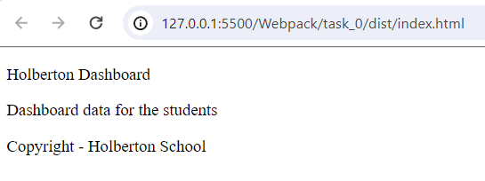
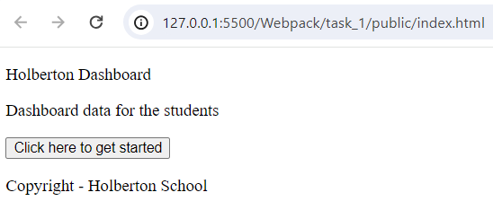
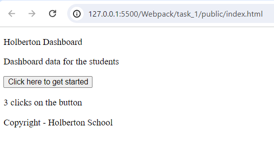
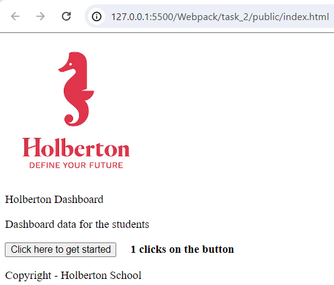
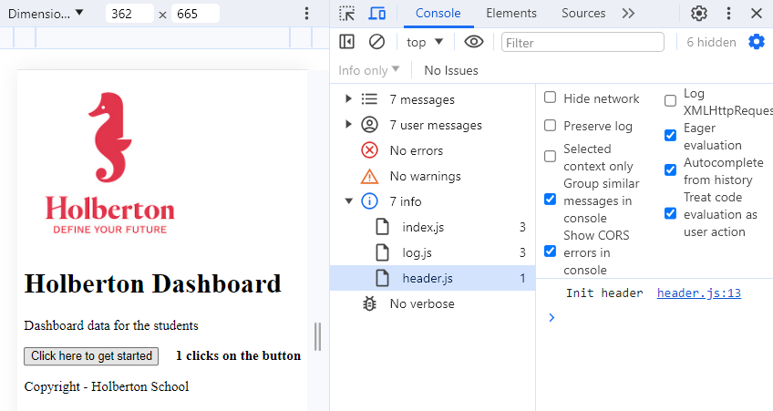
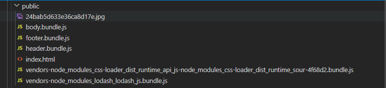
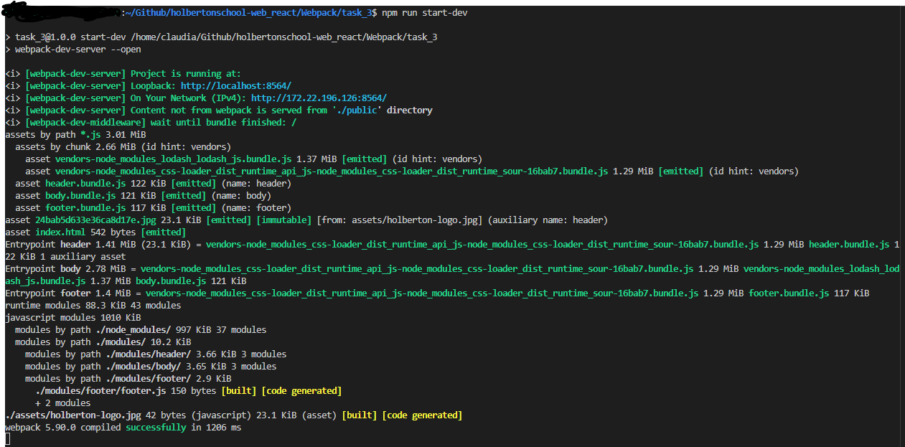

<h1 align="center">Webpack</h1>

<p align="center">
  Coding projects developed as part of the 
  <strong>Full-Stack Web Development</strong> specialization program at  
  <a href="https://www.holbertonschool.com/">
    
  </a>
</p>

<div align="center">

[](https://developer.mozilla.org/en-US/docs/Web/JavaScript)
[](https://nodejs.org/)
[](https://webpack.js.org/)
[](https://api.jquery.com/)
[](https://lodash.com/)
</div>



## Key Features
* Customized setup for optimal code bundling and asset management
* Webpack Dev Server Integration
* Code Splitting Techniques

## Coding projects
Each task was completed within specific constraints regarding allowed libraries, programming languages and development tools.<br>

### [Task 0: Basic Webpack Setup](./task_0) 
Execute Webpack from the command line without any configuration.

### [Task 1: Custom Webpack Setup](./task_1) 
Developed a custom Webpack configuration file to control entry and output points and implemented npm scripts for streamlined Webpack execution

### [Task 2: Bundle non-JavaScript files](./task_2)
Enhanced Webpack configuration to handle CSS files and various assets (e.g., images) and implemented loaders to properly process and bundle non-JavaScript files

### [Task 3: Code split into chunks](./task_3)
Integrated Webpack Dev Server for improved development experience and implemented HTML generation plugin to automate HTML file creation.
Utilized code splitting techniques to create separate bundles for different webpage sections (header, body, footer).
> [!NOTE]
> **webpack-dev-server Version Constraint**
> 
> This project uses `webpack-dev-server` version `^4.15.1` with Node.js 14.x. Newer versions of `webpack-dev-server` (v5.x and above) require Node.js 18.x or higher. Upgrading to Node 18.x is not possible due to incompatibility with the current Ubuntu version.

<details><summary><b>Display Task Results</b></summary>

### Task 0 Webpack setup
<p align="center">
  
</p>
<p align="center"><em>Development Server render of Task 0</em></p>

### Task 1 Custom Webpack setup
<p align="center">
  
</p>
<p align="center"><em>Development Server render of Task 1</em></p>
<p align="center">
  
</p>
<p align="center"><em>Development Server render of Task 1</em></p>

### Task 2 Adding CSS to a webpack bundle
<p align="center">
  
</p>
<p align="center"><em>Development Server render of Task 3</em></p>

### Task 3 Webpack developer server API and code split into chunks
<p align="center">
  
</p>
<p align="center"><em>Development Server render of Task 3</em></p>

<p></p>
<p align="center">
  
</p>
<p align="center"><em>Code split into chunks</em></p>
<p align="center">
  
</p>


</details>

## Project Setup
**Development Environment**
* Editor: Visual Studio Code
* Node 14.21.3 and npm for package management
* Operating System: Ubuntu 18.04.6 LTS<br>

**Technologies**
- JavaScript ES6+
- jQuery 3.x for DOM manipulation
- Webpack 5.x for module boundle
- Lodash for functional utilities<br>

**Getting Started**
1. Ensure Node.js v14.x is installed
2. Clone the repository:
``` bash
git clone https://github.com/21Kgold/holbertonschool-web_react.git
cd holbertonschool-web_react/Webpack/task_0
```
1. Install dependencies:
``` bash
npm install
```
## Usage
<div align="center">
| Description                                                     | Command                |
|:----------------------------------------------------------------|:----------------------:|
| Build for Production (Task 0 only)&nbsp;&nbsp;&nbsp;&nbsp;&nbsp;| `npx webpack`          |
| Build for Production&nbsp;&nbsp;&nbsp;&nbsp;&nbsp;              | `npm run build`        |
| Start Development Server (http://127.0.0.1:8080)&nbsp;&nbsp;&nbsp;&nbsp;&nbsp; | `npx http-server`     |
| Start Development Server and open default browser (Task 3 only)&nbsp;&nbsp;&nbsp;&nbsp;&nbsp; | `npm run start-dev`   |
</div>

* Build for Production (Task 0 only):
``` bash
npx webpack
```
* Build for Production:
``` bash
npm run build
```
* Start Development Server (http://127.0.0.1:8080):
``` bash
npx http-server
```
* Start Development Server and open default browser (Task 3 only)
``` bash
npm run start-dev
```

## Author
<p><strong>Claudia R. Pérez</strong></p>
<p>
  <a href="https://github.com/21Kgold">
    
  </a>
  <a href="https://linkedin.com/in/claudia-tech">
    
  </a>
</p>



Command	Description
npx webpack	Build for Production (Task 0 only)
npm run build	Build for Production
npx http-server	Start Development Server (http://127.0.0.1:8080)
npm run start-dev	Start Development Server and open default browser (Task 3 only)

| Command | Description |
|---------|-------------|
| `npx webpack` | Build for Production (Task 0 only) |
| `npm run build` | Build for Production |
| `npx http-server` | Start Development Server (http://127.0.0.1:8080) |
| `npm run start-dev` | Start Development Server and open default browser (Task 3 only) |

| Description | Command |
|-------------|---------|
| Build for Production (Task 0 only) | `npx webpack` |
| Build for Production | `npm run build` |
| Start Development Server (http://127.0.0.1:8080) | `npx http-server` |
| Start Development Server and open default browser (Task 3 only) | `npm run start-dev` |


| Description                                                     | Command                |
|:----------------------------------------------------------------|:----------------------:|
| Build for Production (Task 0 only)&nbsp;&nbsp;&nbsp;&nbsp;&nbsp;| `npx webpack`          |
| Build for Production&nbsp;&nbsp;&nbsp;&nbsp;&nbsp;              | `npm run build`        |
| Start Development Server (http://127.0.0.1:8080)&nbsp;&nbsp;&nbsp;&nbsp;&nbsp; | `npx http-server`     |
| Start Development Server and open default browser (Task 3 only)&nbsp;&nbsp;&nbsp;&nbsp;&nbsp; | `npm run start-dev`   |
