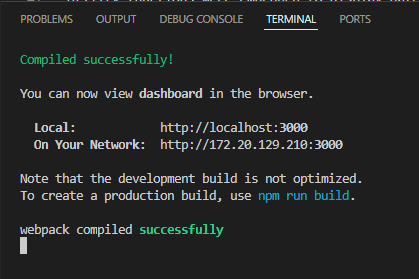
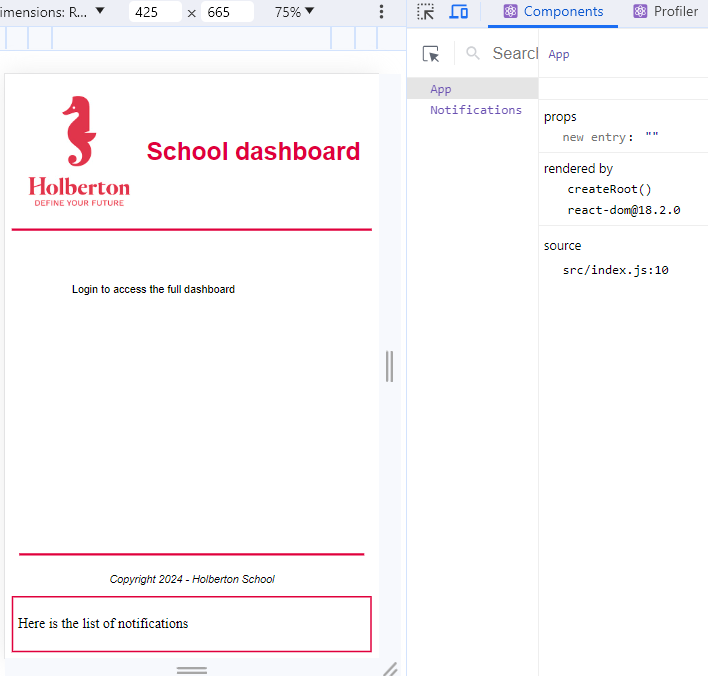
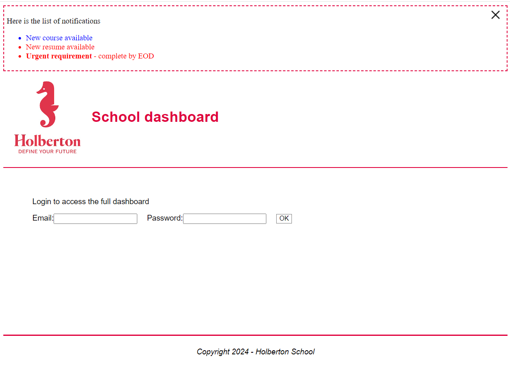
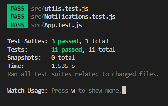
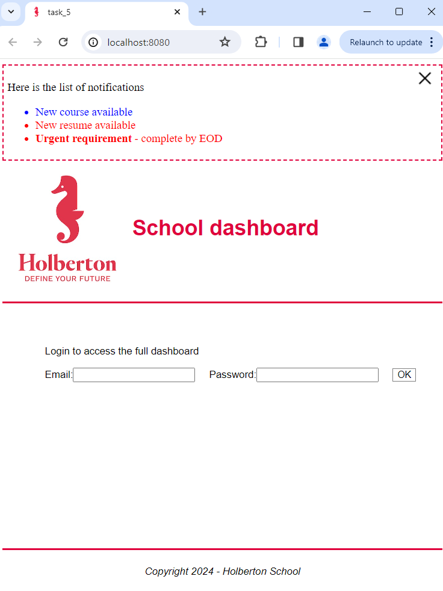

<h1 align="center">React introduction</h1>

<p align="center">
  Coding projects developed as part of the 
  <strong>Full-Stack Web Development</strong> specialization program at  
  <a href="https://www.holbertonschool.com/">
    
  </a>
</p>
<div align="center">

[](https://react.dev)
[](https://nodejs.org/)
[](https://webpack.js.org/)
[](https://babeljs.io/)
[](https://jestjs.io/)
[](https://enzymejs.github.io/enzyme/)
</div>



## Key Features
* React development environment setup using both Create React App (CRA) boilerplate and manual configuration with webpack and babel.
* React components.
* Markup with JSX.
* Integration of React Developer Tools for efficient debugging.
* Shallow rendering for unit testing React components.

## Coding projects
Each task was completed within specific constraints regarding allowed libraries, programming languages and development tools.<br>

### [Task 0: Create React App](./task_0/dashboard/)
Set up a complete React development environment using Create React App (CRA) as boilerplate.<br>
Created a single-page React application with a modified and styled App component, incorporating responsive design principles through flexbox, clamp(), and viewport units.
> [!NOTE] 
> **Create React App (CRA) Deprecated**
>
> The React team has removed CRA from the official documentation, indicating it is no longer the recommended method for setting up new React projects.

### [Task 1: Embedding Utility Functions](./task_1/dashboard/)
Integrated utility functions for date display and homepage detection (isIndex) to customize footer content dynamically. Component's structure was examined using React Developer Tools.
### [Task 2: Additional components](./task_2/dashboard/)
Implemented basic static Notifications and sign-in components.
### [Task 3: Unit Testing](./task_3/dashboard/)
Developed comprehensive unit tests for each component.

> [!NOTE]
> **Enzyme it is no longer actively maintained**
> 
> The React core team discourages the use of Enzyme and recommends switching to React Testing Library.

### [Task 4: Deployment](./task_4/dashboard/)
Successfully deployed the Student Dashboard application to GitHub Pages, making it accessible at https://21kgold.github.io/holbertonschool-web_react/

### [Task 5: Custom React Development Environment](./task_5/dashboard/)
Configured a React development environment from scratch using Webpack, Babel, Jest, and Enzyme. Migrated source files from previous tasks to create the Student Dashboard app within this custom setup.

<details><summary><b>Display Task Results</b></summary>

### Task 0
<p align="center">
  
</p>
<p align="center"><em>Development Server terminal of Task 0</em></p>

### Task 1

<p align="center"><em>Responsive design of Task 1</em></p>

<p align="center">
  
</p>
<p align="center"><em>Development Server render of Task 1 using the React browser extension</em></p>

### Task 2
<p align="center">
  
</p>
<p align="center"><em>Development Server render of Task 2</em></p>

### Task 3
<p align="center">
  
</p>
<p align="center"><em>Development Server terminal of Task 3</em></p>

### Task 5
<p align="center">
  
</p>
<p align="center"><em>Development Server render of Task 5</em></p>
</details>

## Project Setup
**Development Environment**
* Editor: Visual Studio Code
* Node 20.17.0 and npm for package management
* Operating System: Ubuntu 22.04.3 LTS<br>

**Technologies**
- Create react app package
- React 16.x for building user interfaces
- Webpack 5.x for module bundling and asset management
- Babel 7.x for JavaScript transpilation
- Jest 29.x and Enzyme 3.x for testing

**Getting Started**
1. Ensure Node.js v20.x is installed
2. Clone the repository:
``` bash
git clone https://github.com/21Kgold/holbertonschool-web_react.git
cd holbertonschool-web_react/react_intro/task_0/dashboard
```
1. Install dependencies:
``` bash
npm install
```
## Usage
* Build for Production:
``` bash
npm run build
```
* Start Development Server:
``` bash
npm start
```
* Test:
``` bash
npm test
```

## Author
<p><strong>Claudia R. Pérez</strong></p>
<p>
  <a href="https://github.com/21Kgold">
    
  </a>
  <a href="https://linkedin.com/in/claudia-tech">
    
  </a>
</p>

