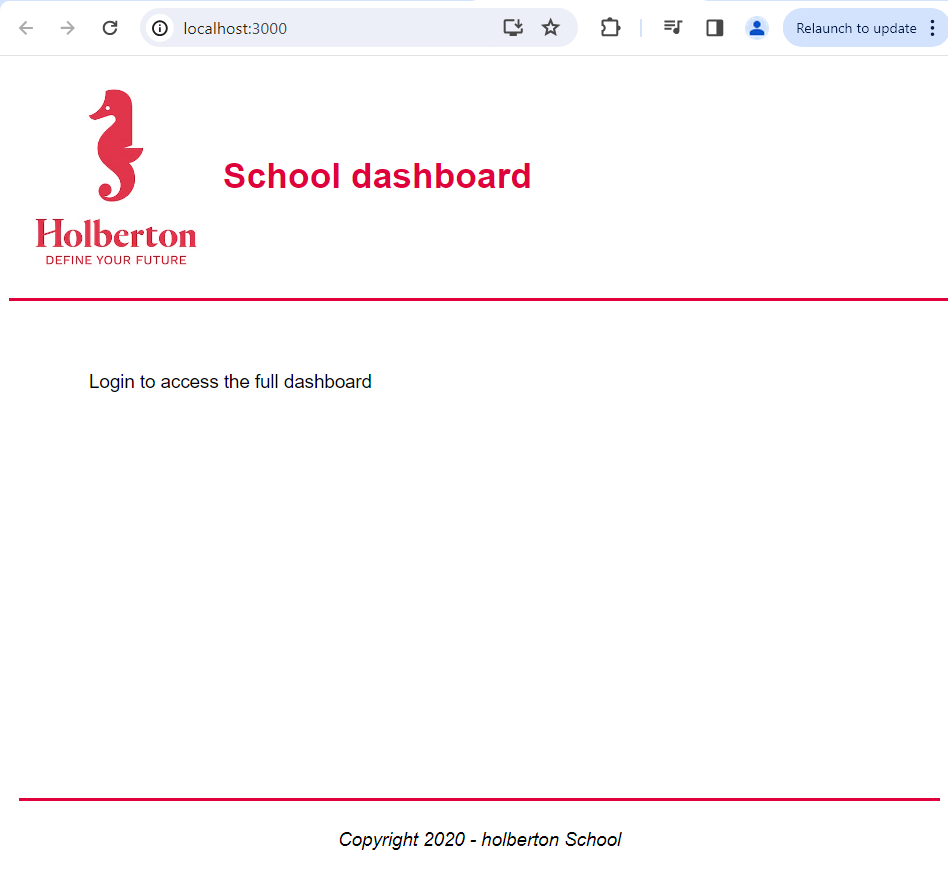
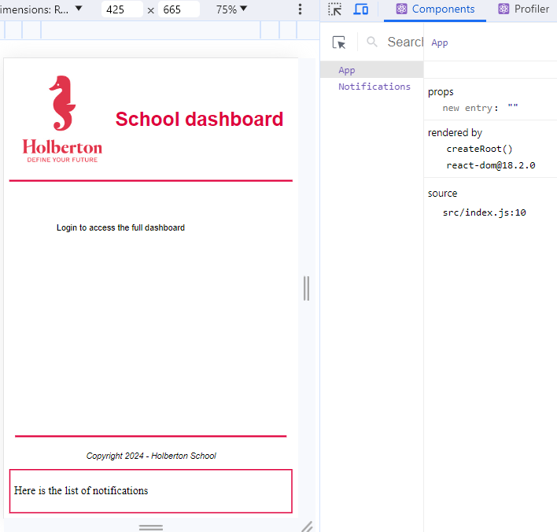
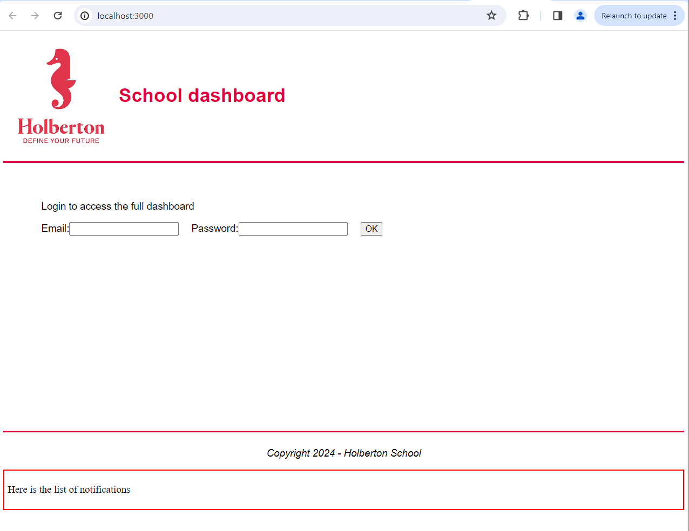
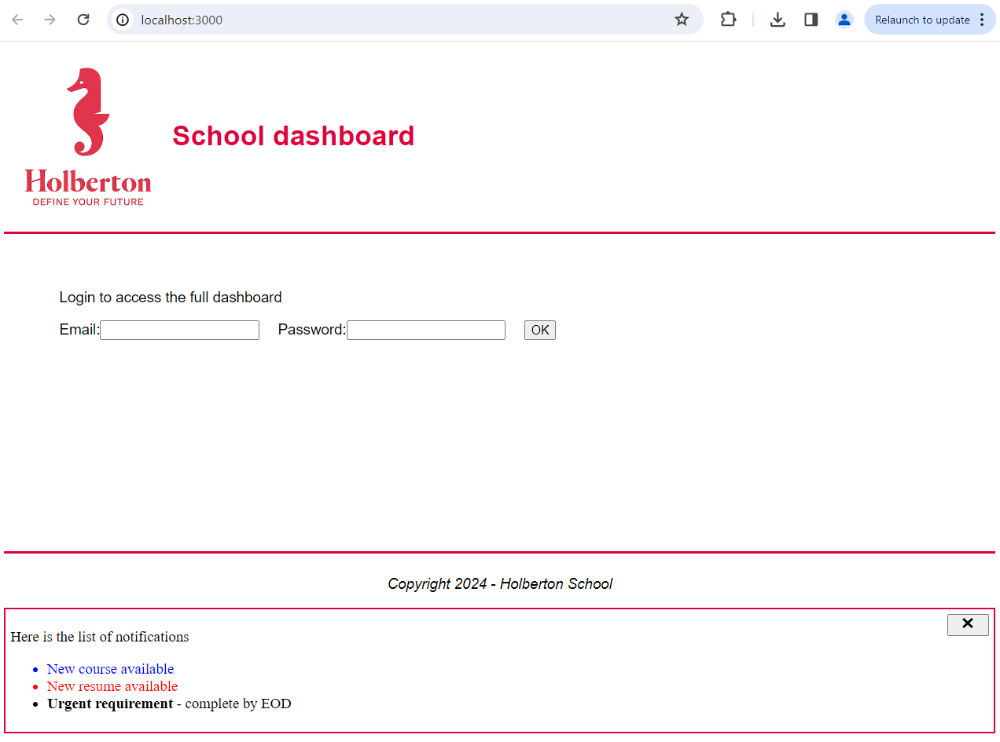

# React intro
Create React App (CRA) is an officially supported way to create single-page React applications. It allow you to create a new React application by running a single command and you don't need to install or configure tools like webpack or Babel. They are preconfigured and hidden and if you ever want an advanced configuration, you can ”eject” from CRA and edit their config files directly.

## Description

* How to create a basic Javascript application using React
* How to use the package create-react-app to start developing quickly with React
* What JSX is and how to use it
* How to use the React Developer Tools to debug your code
* How to use Enzyme’s Shadow rendering to test your application
* How to use React with Webpack & Babel

## Setup

Node Version Manager (NVM), as the name implies, is a tool for managing Node versions on your device.
```
$ curl -o- https://raw.githubusercontent.com/nvm-sh/nvm/v0.38.0/install.sh | bash
```
Close and Reopen Terminal:
```
$ nvm --version
0.38.0
```
Install Node.js with NVM:
```
$ nvm install 14
$ nvm use 14
Now using node v14.21.3 (npm v6.14.18)
```

---

### [0. Creating an interface for a student](./task_0/dashboard/src/App.js)
* Create a basic app named dashboard using create-react-app in a directory named task_0.
* Delete unused files. From package.json we can check that we are using CRA version "5.0.1" and starting from CRA version 4, the service worker files is not longer included by default. But we can delete other unused files.
* Modify the task_0/dashboard/src/App.js and the App.css to make the project looks like the given screenshot.
```
$ npx create-react-app dashboard
$ npm start

Compiled successfully!

You can now view dashboard in the browser.

  Local:            http://localhost:3000
  On Your Network:  http://172.23.252.62:3000

Note that the development build is not optimized.
To create a production build, use npm run build.

webpack compiled successfully
```
<p align="center">
  
</p>

```
$ npm run  build
Compiled successfully.

File sizes after gzip:

  46.61 kB  build/static/js/main.d0d60f05.js
  1.78 kB   build/static/js/787.1cd31a9e.chunk.js
  364 B     build/static/css/main.c172c2f2.css
  ...
```

### [1. Embedding expressions, functions](./task_1/dashboard/src/App.js)
* C

<p align="center">
  
</p>

<p align="center">
  
</p>

<p align="center">
  
</p>

Jest is available by default when you create a new React application using Create React App. You’ll need to add react-test-renderer for rendering test. We can use it() or test() blocks to define tests in files with the .test.js suffix. We can run the tests using the npm test command. This will launch Jest in watch mode, meaning it will re-run your tests every time you save a file.

```
/dashboard$ npm test
 PASS  src/utils.test.js (28.624 s)
  ✓ Current year (1 ms)
  ✓ Webpage footer when true
  ✓ Webpage footer when false
  ✓ Notification (1 ms)

Test Suites: 1 passed, 1 total
Tests:       4 passed, 4 total
Snapshots:   0 total
Time:        47.416 s
```

```
/dashboard$ npm i --save-dev enzyme enzyme-adapter-react-16
/dashboard$ npm i --save-dev enzyme-to-json
```
* Configure Enzyme to use the adapter you’ve installed in your setup file.
* update your Jest configuration to automatically use enzyme-to-json serializer, by adding "snapshotSerializers": ["enzyme-to-json/serializer"] to your Jest configuration in your package.json.
