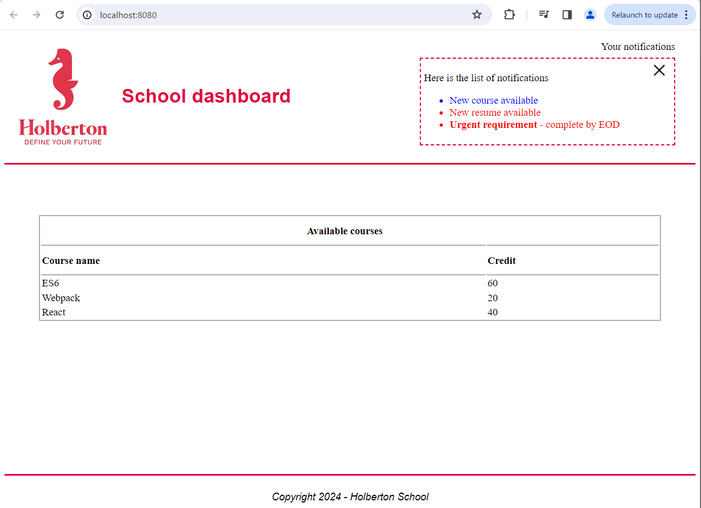
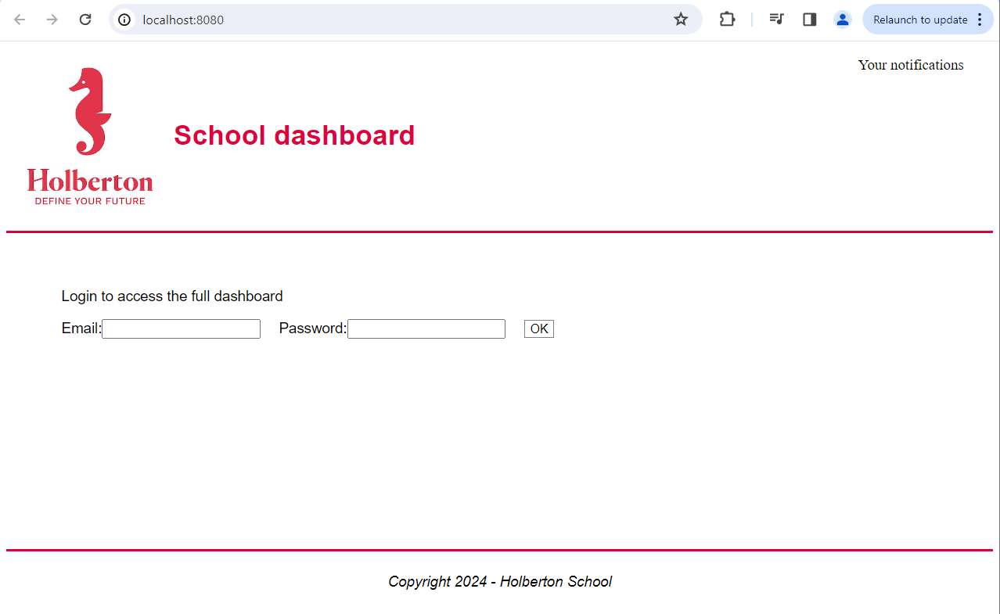

# React props


## Description
* How to create basic React components using functions
* How to reuse components
* How to pass properties to components
* How to define types for components
* How to use Fragments
* When to use a key to improve a loop’s performance

## Setup

### [0. Basic components](.task_0/dashboard/dist/index.html)

```
/task_5/dashboard$ npm run test-watch
...
Test Suites: 9 passed, 9 total
Tests:       36 passed, 36 total
Snapshots:   0 total
Time:        2.396 s, estimated 3 s
```
<p align="center">
  
  
</p>
