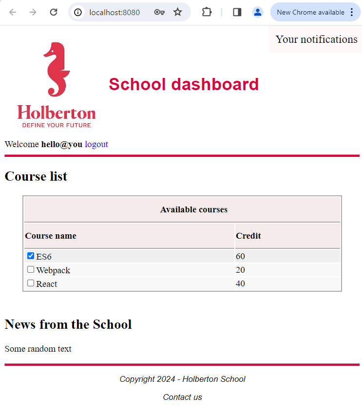

# React state

In React, a [component’s local state](https://legacy.reactjs.org/docs/state-and-lifecycle.html) is a plain JavaScript object that holds information that might affect its rendering. In React, is essential to be familiar with components inner working mechanism. The behavior of a component mainly depends on its props or state. The difference between them is that state is private to a component and is not visible to the outside world. In other words, state is responsible for the behavior of a component behind the scenes and can be considered the source of truth for it. There are multiple ways to manage the state for a component like [local state](https://blog.logrocket.com/component-state-local-state-redux-store-and-loaders/), Redux store, and even the use of this.

In React, you can pass functions as props to child components. This allows child components to communicate back to their parent, enabling them to update the parent’s state.

React Context is a feature in React that allows you to pass data through the component tree without having to pass props down manually at every level. It’s designed to share data that can be considered “global” for a tree of React components.

Arrow functions in JavaScript automatically bind this to the surrounding code’s context. So, if an arrow function is defined within a class, this will refer to the instance of that class. This is why you don’t need to explicitly bind this for arrow functions in a class component in React. We don’t need to bind lifecycle methods in a class component. Lifecycle methods in React class components, such as componentDidMount, componentDidUpdate, and componentWillUnmount, are automatically bound to the instance of the class.

React.PureComponent is similar to React.Component, but it implements the shouldComponentUpdate lifecycle method with a shallow comparison for props and state. This means that it only re-renders the component if there are changes in state or props, which can lead to performance improvements in certain cases.

## Description

* What the state of a component or a container is
* The lifecycle of a component
* How to modify a state and execute code in the right order
* What a controlled component is
* How to use Forms in React
* How to reuse smaller components, keep them pure, and lift its state to principal containers
* The use of a React Hook and how to create one
* How to test State changes with Enzyme

### [task_4](./task_4/dashboard/src/App/App.js)

  

